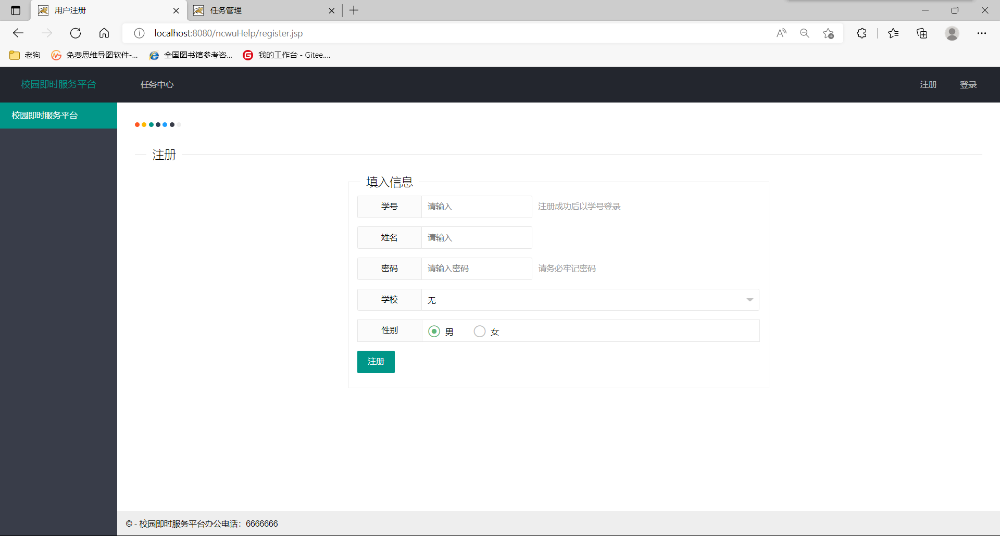

# NCWUHelp
## 校园互助平台
### 开发环境
* Visio画图工具：制作E-R实体关系图，数据流图和数据字典等图示；
* MySQL8.0：创建数据库，数据表进行后台存储；
* eclipse：编译java web程序；
* tomcat9.0：web应用服务器。
### 功能图

### E-R图

### 顶层数据流图图

### 登录

### 注册

### 任务管理

